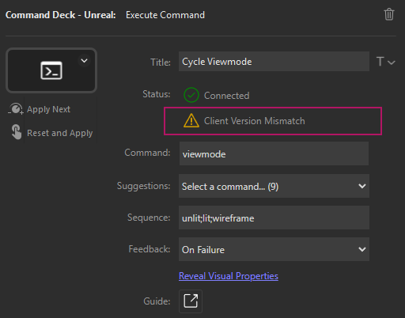

> 💡 New to Command Deck? Check out the [Get Started with Command Deck](InstallPlugins.md) guide for help with setup and installation.

> 💬 We'd love to hear from you! Join our [Discord server](https://go.commanddeck.io/docs.feedback) and let us know how we can improve.

# Versioning

_Command Deck_ depends on two plugins, the Unreal Engine plugin, and the Stream Deck plugin. Each plugin has its own version, and the MAJOR and MINOR versions must match.

Both plugins are semantically versioned, defined by 4 numeric values that represent the _Major_ version, the _Minor_ version, the _Patch_ version, and the _Build_ version.

For example, the version `0.5.2.1` indicates the following: _Major version_ = `0`, _Minor_ version = `5`, _Patch_ version = `2`, and _Build_ version = `1`.

The _Major_ and _Minor_ version of the Unreal Engine plugin and the Stream Deck plugin must match.

For example, the Unreal Engine plugin version `0.5.2.1` and the Stream Deck plugin version `0.5.3.0` are compatible as the _Major_ version (`0`) and _Minor_ version (`5`) match.

> 💡 Version compatibility is not strictly required, however, actions may no longer function or behave as expected. Version compatibility is highly recommended!

## Table of Contents

- [Detecting a Version Mismatch](#detecting-a-version-mismatch)
- [Check the Unreal Plugin Version](#check-the-unreal-plugin-version)
- [Update the Unreal Plugin](#update-the-unreal-plugin)
- [Check the Stream Deck Plugin Version](#check-the-stream-deck-plugin-version)
- [Update the Stream Deck Plugin](#update-the-stream-deck-plugin)

## Detecting a Version Mismatch

If the version of the Stream Deck plugin and Unreal Plugin are incompatible, a warning will appear in the property inspector during setup of an action.

<table>
<tr>
<td></td>
<td><em>The </em>Execute Command<em> action property inspector with the version mismatch warning.</td>
</tr>
</table>

By moving the mouse over the warning indicator, a tooltip will inform you of the client and plugin version.

<table>
<tr>
<td></td>
<td><em>The tooltip will show the version of both the Stream Deck plugin and the Unreal (client) plugin.</td>
</tr>
</table>

> ⚠️ The action must be connected to Unreal before version compatibility is checked. Follow the [Get Connected](GetConnected.md) guide to learn how!

> 💡 The Stream Deck plugin log will report an error if there is a version mismatch. Learn more about logging here: [Enable and Configure Logging](EnableAndConfigureLogging.md)

## Check the Unreal Plugin Version

To check the version of the Unreal Engine plugin:
1. Open the Unreal Engine editor
2. Click _Edit_ -> _Plugins_
3. Enter `Command Deck` into the search bar of the _Plugins_ window

<table>
<tr>
<td></td>
<td><em>The </em>Command Deck<em> plugin version can be viewed within the Unreal Engine editor.</em></td>
</tr>
</table>

> ⚠️ If the _Command Deck_ plugin does not appear in the list of plugins, follow the [Get Started with Command Deck](InstallPlugins.md) guide for installation instructions.

## Update the Unreal Plugin

Open the Epic Games Launcher, select _Unreal Engine_ from the left-hand side and then the _Library_ tab.

Each installed engine version can be found under _Engine Versions_. Click _Installed Plugins_ for each engine version where the Command Deck plugin has been installed.

<table>
<tr>
<td></td>
<td><em>The </em>Installed Plugins<em> window available from within the Epic Games Launcher.</em></td>
</tr>
</table>

Click the _Update_ button to install the latest version of the _Command Deck_ plugin!

## Check the Stream Deck Plugin Version

To check the version of the Stream Deck plugin:
1. Open the Stream Deck app
2. Click the _Preferences_ button (⚙️) 
3. Click _Command Deck - Unreal_ from the list of installed plugins under _Marketplace_

<table>
<tr>
<td></td>
<td><em>The version of the </em>Command Deck<em> plugin can be found within the Stream Deck app.</em></td>
</tr>
</table>

> ⚠️ If the _Command Deck - Unreal_ plugin does not appear in the list of plugins, follow the [Get Started with Command Deck](InstallPlugins.md) guide for installation instructions.

## Update the Stream Deck Plugin

To update to the latest version of the Stream Deck plugin, simply click the _Check for Updates..._ button.

If the plugin fails to update, try restarting the Stream Deck app.

If still unsuccessful, as a last resort you can uninstall and reinstall the plugin. This will not remove or reset actions that have been assigned to profiles.