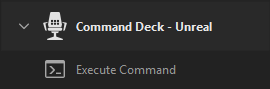

> 💡 New to Command Deck? Check out the [Get Started with Command Deck](../InstallPlugins.md) guide for help with setup and installation.

#  Execute Command Action User Guide

The _Execute Command_ action provides a convenient way, as the name implies, to execute commands within the Unreal Engine!

Setup is a breeze, with automatic suggestions of known commands and helpful information about commands shown directly in Stream Deck. 

To get started, simply add the _Execute Command_ action to your Stream Deck!

## Table of Contents

- [Tips and Tricks](#tips-and-tricks)
- [Setup through the Property Inspector](#setup-through-the-property-inspector)
  - [Title](#title)
  - [Status](#status)
  - [Command](#command)
  - [Suggestions](#suggestions)
  - [Sequence](#sequence)

## Tips and Tricks

> 💡 Start your sequence with the first non-default value of the command. For example, if the default is _false_, start your sequence with _true_.

> 💡 Key Action: Use _Multi Action_ to execute multiple commands with a single press. Learn more about Multi Actions here: [help.elgato.com](https://help.elgato.com/hc/en-us/articles/360027960912-Elgato-Stream-Deck-Multi-Actions)

> 💡 Dial Action: Pressing the dial will reset the sequence and apply the first value.

> 💡 Dial Action: Rotating the dial counter-clockwise will apply the sequence values in reverse order.

## Setup through the Property Inspector

### Title

The user-specified title for the action. If this is left blank, the value of the _Command_ text box will be displayed as the title.

> 💡 To learn more about the behavior of Stream Deck titles, read the [Understanding Action Titles](../UnderstandingActionTitles.md) guide.

### Status

Like most _Command Deck_ actions, the status indicator allows you to immediately determine if the action is ready for use.

The _Execute Command_ action requires an active connection to the Unreal Engine editor (with the _Command Deck_ Unreal plugin enabled).

This action has two states,  _Connected_ and  _Disconnected_.

> 💡 Need help getting connected? Follow the [Get Connected](../GetConnected.md) guide to resolve connection issues.

### Command

The _Command_ text box is where the desired command is specified. This command, combined with the _Sequence_ value (when specified) is sent to the Unreal Engine when the action is activated.

If the _Command_ text matches a known command in the engine, additional information about the command is displayed below the text box.

<table>
<tr>
<td></td>
<td><em>Example showing additional information for the <code>au.3dVisualizeActiveSounds</code> command</em></td>
</tr>
</table>

### Suggestions

If the _Command_ text partially matches any known commands, the _Suggestions_ combo box will appear, allowing you to quickly choose from the list of known commands.

<table>
<tr>
<td></td>
<td><em>Example showing the suggested commands that partially match the <code>au.3d</code> text from the</em> Command <em>text box</em></td>
</tr>
</table>

### Sequence

The _Sequence_ text box is where the command value is specified. As the name implies, a sequence of values can be defined that is applied (in order) every time the action is activated.

Let's take an example where _Command_ is set to `au.3dVisualize.ActiveSounds` and _Sequence_ is set to `0;1;2;3`, and the action is assigned to a Stream Deck Key. On the first press of the key, `au.3dVisualizeActiveSounds 0` is sent to the Unreal Engine. The second press of the key will send `au.3dVisualizeActiveSounds 1`, and so on.

Once the end of the sequence is reached, the sequence will repeat.

> ℹ️ Not all commands can be found in the _Suggestions_ combo box. For example, the command `viewmode` with sequence `unlit;lit;wireframe` can be used to quickly switch the editor _View Mode_.

> ℹ️ Commands of type `Setting` do not require a value. If a command of this type is specified, the _Sequence_ text box will be disabled.