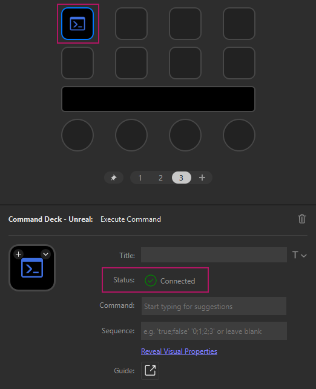
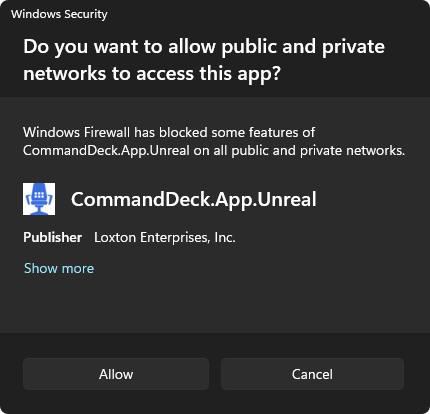
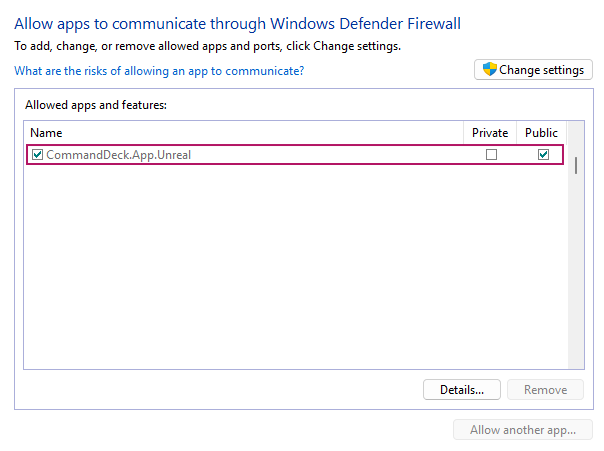

> 💡 New to Command Deck? Check out the [Get Started with Command Deck](InstallPlugins.md) guide for help with setup and installation.

> 💬 We'd love to hear from you! Join our [Discord server](https://go.commanddeck.io/docs.feedback) and let us know how we can improve.

# Get Connected

Many actions within _Command Deck_ require a connection to the Unreal Engine to function. This connection is made using a local web socket, a simple network protocol that enables two-way communication over TCP. 

Follow the below steps to resolve any connection issues you may be experiencing!

## Table of Contents

1. [Check the Connection Status](#1-check-the-connection-status)
2. [Check the Command Deck Unreal Engine Plugin is Enabled](#2-check-the-command-deck-unreal-engine-plugin-is-enabled)
3. [Check for Matching Versions](#3-check-for-matching-versions)
4. [Check Windows Firewall Permissions](#4-check-windows-firewall-permissions)
5. [Contact Support](#5-contact-support)

## 1. Check the Connection Status

Actions that require a connection have a "status" indicator in their property inspector that will be in one of two states,  _Connected_ or  _Disconnected_.

To check the status of an action, select the action assigned to an active Stream Deck profile to reveal its property inspector.

<table>
<tr>
<td></td>
<td><em>Example showing a profile where the </em>Execute Command<em> action is selected. Below, the property inspector is visible with a connection status indicator.</em></td>
</tr>
</table>

## 2. Check the Command Deck Unreal Engine Plugin is Enabled

The _Command Deck_ Unreal plugin must be installed and enabled to successfully connect to Stream Deck. 

To check the status of the plugin:
1. Open the Unreal Engine editor
2. Click _Edit_ -> _Plugins_
3. Enter `Command Deck` into the search bar of the _Plugins_ window
4. Verify that the checkbox is ticked

<table>
<tr>
<td></td>
<td><em>Example showing the </em>Command Deck<em> plugin enabled within the Unreal Engine editor.</em></td>
</tr>
</table>

> ⚠️ If the _Command Deck_ plugin does not appear in the list of plugins, follow the [Get Started with Command Deck](InstallPlugins.md) guide for installation instructions.

## 3. Check for Matching Versions

The _Major_ and _Minor_ version of the Unreal Engine plugin and the Stream Deck plugin must match.

To check for (and update to) compatible plugin versions, read the [Versioning](Versioning.md) guide.

## 4. Check Windows Firewall Permissions

Any application that utilizes a web socket must have permission to access the _Public_ network on the local machine.

When the Stream Deck plugin is first installed, you will be prompted to grant the plugin _Public_ access.

<table>
<tr>
<td></td>
<td><em>Example showing the Windows prompt asking to grant </em>Command Deck - Unreal<em> network access.</em></td>
</tr>
</table>

To confirm that access has been granted:
1. From the _Start Menu_, type _Windows Defender Firewall_
2. Click _Allow an app or feature through Windows Defender Firewall_
3. Confirm that _Command Deck.App.Unreal_ is listed, and that the _Public_ checkbox has been ticked

<table>
<tr>
<td></td>
<td><em>Example showing the network access permitted to </em>Command Deck - Unreal</td>
</tr>
</table>

## 5. Contact Support

Still unable to connect? It's time to contact support!

Join the #support channel on our [Discord server](https://go.commanddeck.io/docs.support), or reach us at [support@commanddeck.io](mailto:support@commanddeck.io).