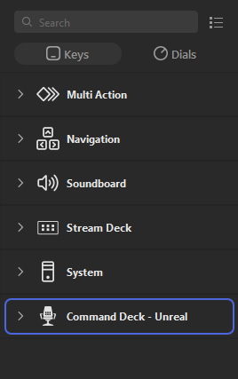

> 🚧 This page is currently under construction

# Unreal Plugin Install

## Install the plugin to your engine

Open the Epic Launcher and navigate to the Library tab. The `Command Deck` plugin will appear in your FAB Library. Click the `Install to Engine` button, select an engine slot and click `Install`.

# Enable the plugin in the Unreal Editor

Launch the Unreal Editor and from the top menu select Edit > Plugins. Find `Command Deck` in the list of plugins, and ensure that it has been enabled (indicated by the checkbox).

# Stream Deck Plugin Install

## Install Stream Deck

Download and install the `Stream Deck` software (requires Windows 11 or later): [Download](https://www.elgato.com/us/en/s/downloads)

## Install the plugin to Stream Deck

Download and install the `Command Deck - Unreal` Stream Deck plugin from the Elgato Marketplace: [Download](https://marketplace.elgato.com/product/command-deck-unreal-17d6cac4-0985-449f-a565-8b1ebca6df31)

Once the plugin has been installed, `Command Deck - Unreal` should appear in the list of plugins.

# Action Install

## Add Action to Device

From the `Command Deck - Unreal` plugin, select an action and drag it onto your Stream Deck device.